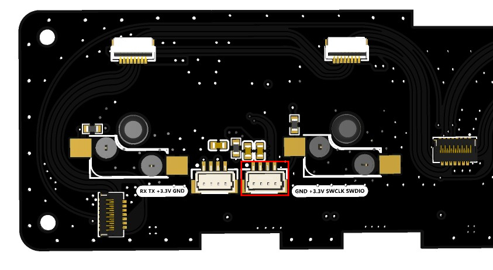
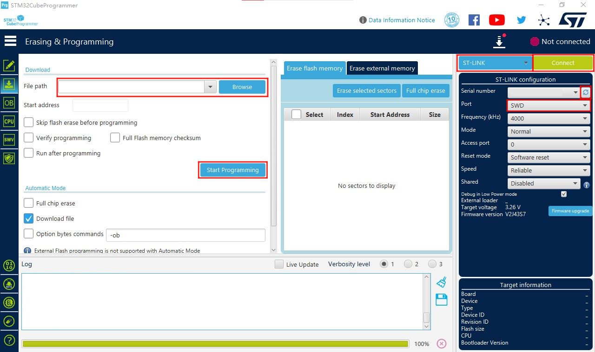

<!--
 * @Description: None
 * @Author: LILYGO_L
 * @Date: 2023-09-11 16:13:14
 * @LastEditTime: 2025-01-23 18:13:20
 * @License: GPL 3.0
-->
<h1 align = "center">T-Keyboard-S3-Pro_STM32G0</h1>

## **English | [中文](./README_CN.md)**

## Directory
- [Describe](#Describe)
- [Preview](#Preview)
- [SoftwareDeployment](#SoftwareDeployment)
- [PinOverview](#PinOverview)
- [RelatedTests](#RelatedTests)

## Describe

This is the software configuration branch for the T-Keyboard-S3-Pro board using the STM32G0 and HAL library for programming. You can use the STM32CubeMX + ARM Keil μVision5 form for programming.

It's important to note that different branches have different compiler library versions, so be sure to pay attention to this detail.

## Preview

### PCB board

### Rendering

## SoftwareDeployment

### Examples Support

| Example | Description | Picture |
| ------  | ------ | ------ | 
| [KEY](./examples/KEY) |  |  |
| [Original_Test](./examples/Original_Test) | Product factory original testing |  |
| [T-Keyboard-S3-Pro_IIC_Command](./examples/T-Keyboard-S3-Pro_IIC_Command) |  |  |
| [WS2812B](./examples/WS2812B) |  |  |

| Firmware | Description | Picture |
| ------  | ------  | ------ |
| [Slave_0x01_Original_Test_V1.0.0](./firmware/（修复LED的HUE值设置失败问题）[STM32G030F6P6_Drive_0x01][T-Keyboard-S3-Pro_V1.0][Original_Test]_firmware_V2_202501231722.hex) | Initial test file for slave device 0x01 at factory |  |
| [Slave_0x02_Original_Test_V1.0.0](./firmware/（修复LED的HUE值设置失败问题）[STM32G030F6P6_Drive_0x02][T-Keyboard-S3-Pro_V1.0][Original_Test]_firmware_V2_202501231722.hex) | Initial test file for slave device 0x02 at factory |  |
| [Slave_0x03_Original_Test_V1.0.0](./firmware/（修复LED的HUE值设置失败问题）[STM32G030F6P6_Drive_0x03][T-Keyboard-S3-Pro_V1.0][Original_Test]_firmware_V2_202501231722.hex) | Initial test file for slave device 0x03 at factory |  |
| [Slave_0x04_Original_Test_V1.0.0](./firmware/（修复LED的HUE值设置失败问题）[STM32G030F6P6_Drive_0x04][T-Keyboard-S3-Pro_V1.0][Original_Test]_firmware_V2_202501231722.hex) | Initial test file for slave device 0x04 at factory |  |
| [Slave_0x05_Original_Test_V1.0.0](./firmware/（修复LED的HUE值设置失败问题）[STM32G030F6P6_Drive_0x05][T-Keyboard-S3-Pro_V1.0][Original_Test]_firmware_V2_202501231722.hex) | Initial test file for slave device 0x05 at factory |  |
| [Slave_0x06_Original_Test_V1.0.0](./firmware/（修复LED的HUE值设置失败问题）[STM32G030F6P6_Drive_0x06][T-Keyboard-S3-Pro_V1.0][Original_Test]_firmware_V2_202501231722.hex) | Initial test file for slave device 0x06 at factory |  |

### Related Commands

By default, the STM32G0 is used as a slave device to work in conjunction with the host for data exchange, thereby controlling the devices on the sub-board. They communicate using the standard IIC protocol, and the related instruction program has been written at the factory, as shown in the figure below. For detailed information, please open the following IIC register log.

    

| Log | Description | Picture |
| ------  | ------  | ------ |
| [T-Keyboard-S3-Pro_STM32G0_IIC_Register_V1.0.0](./information/T-Keyboard-S3-Pro_STM32G0_IIC_Register_V1.0.0.pdf) | Original version |  |

### IDE

#### STM32CubeMX

1.  Install [JAVA](https://www.java.com/en/download/), as you need to install JAVA before installing STM32CubeMX.
    
2.  Install [STM32CubeMX](https://www.st.com/en/development-tools/stm32cubemx.html), and select the installation according to your system type.
    
3.  Open STM32CubeMX, find "[Help->Manage embedded software packages](./image/1.jpg)" in the menu bar, open the software package manager, select the "STM32G0" package, and download and install the corresponding version of the package.
    
4.  After completing the above preparation, you can use STM32CubeMX to configure your engineering project. Example code includes project files configured with STM32CubeMX. Open the ".ioc" files in the example folder.

#### ARM Keil μVision5

1.  Install [ARM Keil μVision5](https://www.keil.arm.com/mdk-community/), and select the installation according to your system type.
    
2.  Open Keil, find the "[Pack Installer](./image/2.jpg)" option in the menu bar to open the software package manager. In the software package manager, search for "[STM32G0](./image/3.jpg)", and install the software library of version 1.4.0.
    
3.  Install the debugger driver used, and find the support type of the debugger in the "Debug" section of "[Options for](./image/5.jpg)" in the Keil menu bar. Additionally, you need to set up the "programming algorithm" as shown in the following figure.
    

    

The debugging port of STM32G0 on the board is located on the back of the "T-Keyboard-S3-Pro_Keyboard" board, as shown in the following figure.

    

4.  Open any example file with the suffix ".uvprojx" under the example directory, click "[Rebuild](./image/4.jpg)" in the menu bar to build, connect the debugger, and click "Download" to download the program.

#### STM32CubeProgrammer

1.  Install [STM32CubeProgrammer](https://www.st.com/en/development-tools/stm32cubeprog.html), and select the installation according to your system type.
    
2.  Open STM32CubeMX, select the correct debugger, here taking STLINK as an example, as shown in the red box in the following figure, configure the firmware file to be downloaded, click "Start Programming" to begin the download. The process for UART download is similar.
    

    

The UART debugging port on the board is located on the back of the "T-Keyboard-S3-Pro\_Keyboard" board, as shown in the following figure.

    

## PinOverview

| IIC pins  | STM32G0 pins|
| :------------------: | :------------------:|
| SDA         |   PC14/PB9   |
| SCL         | PB7/PB8       |

| KEY pins  | STM32G0 pins|
| :------------------: | :------------------:|
| KEY1         | PA1       |
| KEY2         | PA0       |
| KEY3         | PC15       |
| KEY4         | PB3/PB4/PB5/PB6       |
| KEY5         | PA12[PA10]       |

| LCD Screen pins  | STM32G0 pins|
| :------------------: | :------------------:|
| LCD_CS1         |     PA4       |
| LCD_CS2         | PA11[PA9]       |
| LCD_CS3         | PB0/PB1/PB2/PA8       |
| LCD_CS4         | PA6       |
| LCD_CS5         | PA5       |

| LED pins  | STM32G0 pins|
| :------------------: | :------------------:|
| WS2812B_DATA         |     PA7       |

## RelatedTests

