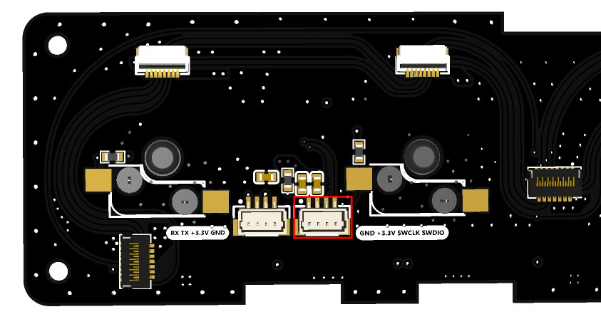
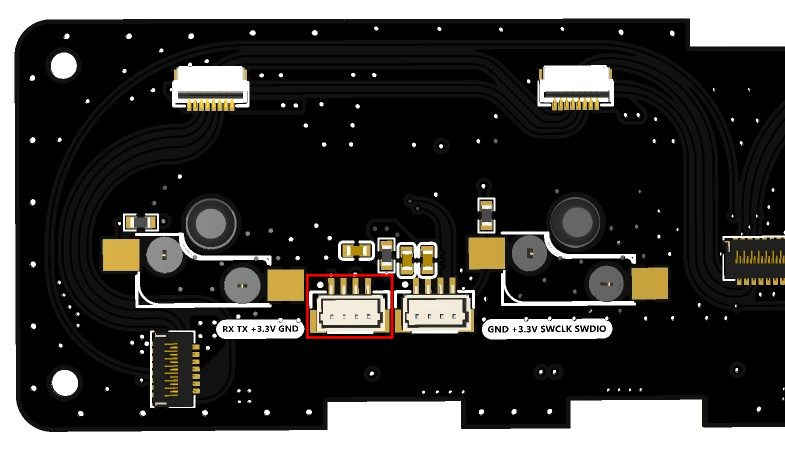

<!--
 * @Description: None
 * @Author: LILYGO_L
 * @Date: 2023-09-11 16:13:14
 * @LastEditTime: 2025-01-23 18:12:42
 * @License: GPL 3.0
-->
<h1 align = "center">T-Keyboard-S3-Pro_STM32G0</h1>

## **[English](./README.md) | 中文**

## 目录
- [描述](#描述)
- [预览](#预览)
- [快速开始](#软件部署)
- [引脚总览](#引脚总览)
- [相关测试](#相关测试)

## 描述

此处为T-Keyboard-S3-Pro板子的STM32G0软件配置分支，使用hal库来编程，您可以使用STM32CubeMX+ARM Keil μVision5的形式来编程

不同分支有不同的编译库版本，这里需要注意一下。

## 预览

### PCB板

### 渲染图

## 软件部署

### 示例支持

| Example | Description | Picture |
| ------  | ------ | ------ | 
| [KEY](./examples/KEY) |  |  |
| [Original_Test](./examples/Original_Test) | 出厂初始测试文件 |  |
| [T-Keyboard-S3-Pro_IIC_Command](./examples/T-Keyboard-S3-Pro_IIC_Command) |  |  |
| [WS2812B](./examples/WS2812B) |  |  |

| Firmware | Description | Picture |
| ------  | ------  | ------ |
| [Slave_0x01_Original_Test_V1.0.0](./firmware/（修复LED的HUE值设置失败问题）[STM32G030F6P6_Drive_0x01][T-Keyboard-S3-Pro_V1.0][Original_Test]_firmware_V2_202501231722.hex) | 出厂时从机设备0x01的初始测试文件 |  |
| [Slave_0x02_Original_Test_V1.0.0](./firmware/（修复LED的HUE值设置失败问题）[STM32G030F6P6_Drive_0x02][T-Keyboard-S3-Pro_V1.0][Original_Test]_firmware_V2_202501231722.hex) | 出厂时从机设备0x01的初始测试文件 |  |
| [Slave_0x03_Original_Test_V1.0.0](./firmware/（修复LED的HUE值设置失败问题）[STM32G030F6P6_Drive_0x03][T-Keyboard-S3-Pro_V1.0][Original_Test]_firmware_V2_202501231722.hex) | 出厂时从机设备0x01的初始测试文件 |  |
| [Slave_0x04_Original_Test_V1.0.0](./firmware/（修复LED的HUE值设置失败问题）[STM32G030F6P6_Drive_0x04][T-Keyboard-S3-Pro_V1.0][Original_Test]_firmware_V2_202501231722.hex) | 出厂时从机设备0x01的初始测试文件 |  |
| [Slave_0x05_Original_Test_V1.0.0](./firmware/（修复LED的HUE值设置失败问题）[STM32G030F6P6_Drive_0x05][T-Keyboard-S3-Pro_V1.0][Original_Test]_firmware_V2_202501231722.hex) | 出厂时从机设备0x01的初始测试文件 |  |
| [Slave_0x06_Original_Test_V1.0.0](./firmware/（修复LED的HUE值设置失败问题）[STM32G030F6P6_Drive_0x06][T-Keyboard-S3-Pro_V1.0][Original_Test]_firmware_V2_202501231722.hex) | 出厂时从机设备0x01的初始测试文件 |  |

### 相关指令

默认情况下STM32G0被作为从机设备配合主机进行数据交换，从而控制副板上的设备，他们使用标准IIC协议进行通信，出厂的时候已经写好相关指令程序如下图，详细资料请打开以下IIC寄存器日志。

    

| Log | Description | Picture |
| ------  | ------  | ------ |
| [T-Keyboard-S3-Pro_STM32G0_IIC_Register_V1.0.0](./information/T-Keyboard-S3-Pro_STM32G0_IIC_Register_V1.0.0.pdf) | Original version |  |

### IDE

#### STM32CubeMX
1. 安装[JAVA](https://www.java.com/en/download/)，安装STM32CubeMX前需要安装JAVA。

2. 安装[STM32CubeMX](https://www.st.com/en/development-tools/stm32cubemx.html)，根据你的系统类型选择安装。

3. 打开STM32CubeMX，找到菜单栏中的“[Help->Manage embedded software packages](./image/1.jpg)”打开软件包管理，选择“STM32G0”的软件包，下载按安装对应版本的软件包即可。

4. 以上准备工作完成后你就可以使用STM32CubeMX来配置你的工程项目了。示例代码中有包含STM32CubeMX配置好的项目文件，打开示例文件夹中后缀名为“.ioc”的文件就是。

#### ARM Keil μVision5
1. 安装[ARM Keil μVision5](https://www.keil.arm.com/mdk-community/)，根据你的系统类型选择安装。

2. 打开Keil，找到菜单栏的“[Pack Installer](./image/2.jpg)”选项打开软件包管理器，在软件包管理器页面搜索“[STM32G0](./image/3.jpg)”，选择1.4.0版本的软件库安装。

3. 安装好使用的调试器驱动，调试器的支持类型可以在Keil的菜单栏的“[Options for](./image/5.jpg)”中的“Debug”栏中找到，此外还需要设置好“programming algorithm”如下图所示。

    

板子上的STM32G0的调试口在“T-Keyboard-S3-Pro_Keyboard”板子的背面如下图

    

4. 打开示例目录下的任意一个后缀名为“.uvprojx”的示例，点击菜单栏的“[Rebuild](./image/4.jpg)”构建并插上调试器连接好设备点击“[Download](./image/4.jpg)”下载程序

#### STM32CubeProgrammer
1. 安装[STM32CubeProgrammer](https://www.st.com/en/development-tools/stm32cubeprog.html)，根据你的系统类型选择安装。

2. 打开STM32CubeMX，选择正确的调试器，这里以STLINK为例子， 如下图红框所示配置，选择要下载的firmware文件，点击“Start Programming”开始下载。使用UART下载同理。

    

板子上的UART的调试口在“T-Keyboard-S3-Pro_Keyboard”板子的背面如下图

    

## 引脚总览

| IIC引脚  | STM32G0引脚|
| :------------------: | :------------------:|
| SDA         |   PC14/PB9   |
| SCL         | PB7/PB8       |

| KEY引脚  | STM32G0引脚|
| :------------------: | :------------------:|
| KEY1         | PA1       |
| KEY2         | PA0       |
| KEY3         | PC15       |
| KEY4         | PB3/PB4/PB5/PB6       |
| KEY5         | PA12[PA10]       |

| LCD屏幕引脚  | STM32G0引脚|
| :------------------: | :------------------:|
| LCD_CS1         |     PA4       |
| LCD_CS2         | PA11[PA9]       |
| LCD_CS3         | PB0/PB1/PB2/PA8       |
| LCD_CS4         | PA6       |
| LCD_CS5         | PA5       |

| LED灯引脚  | STM32G0引脚|
| :------------------: | :------------------:|
| WS2812B_DATA         |     PA7       |

## 相关测试
